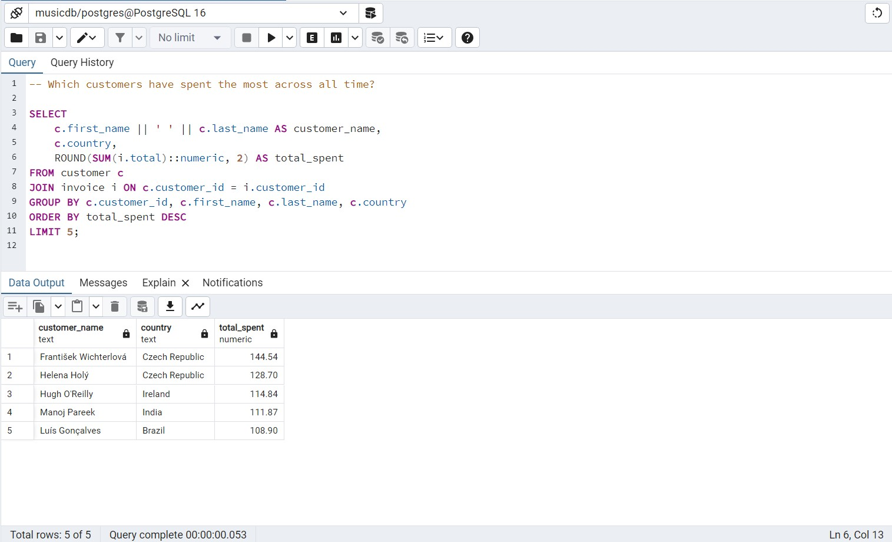

# Neon Bison Music Band Analysis

A comprehensive PostgreSQL-based analytics project for **Neon Bison**, a fictional American music band. Using real-world music store data, this project uncovers patterns in customer behavior, genre popularity, geographic spending, and revenue optimization — aimed at guiding the band’s next concert tour planning. This is a completely stand-alone project created for the purpose of demonstrating skills to solve business problems and acquire technical mastery.

---

<details>
<summary><strong>Table of Contents</strong></summary>

- [Project Overview](#project-overview)  
- [Data Loading](#data-loading)  
- [Dataset Description](#dataset-description)  
- [Entity-Relationship Diagram](#entity-relationship-diagram)  
- [Business Questions Answered](#business-questions-answered)  
- [Key Insights](#key-insights)  
- [Technical Skills Demonstrated](#technical-skills-demonstrated)  
- [Folder Structure](#folder-structure)  
- [Conclusion](#conclusion)  

</details>

---

<a id="project-overview"></a>
<details>
<summary><strong>Project Overview</strong></summary>

This project simulates a business intelligence case for a band preparing to scale up its operations globally. Using SQL queries in PostgreSQL, we analyze historical digital music store data to derive insights across dimensions like customer behavior, sales geography, media preferences, genre trends, and revenue contributions by artists.

The findings can inform setlist decisions, marketing geography, pricing strategies, and tour planning. To make informed decisions, they are analyzing past music store data to uncover:

- Who their top customers are  
- Which cities or countries have the highest engagement  
- Which genres and artists are most popular  
- What revenue patterns exist across markets and media  

All queries are written in PostgreSQL.

</details>

---

<a id="data-loading"></a>
<details>
<summary><strong>Data Loading</strong></summary>

This section demonstrates how the dataset was imported and loaded to PostgreSQL database locally before our analysis. First a database was created and then we used automation for uploading the `.CSV` files using `Python` on the `Jupyter Notebook`. We used the `SQLAlchemy` library to import the functions to have the files path and do the task for us.
However, it is difficult to visually show how we achieved that in this `README.md` file, but you can take a quick look of that code running by clicking this.

> 📁 `validation/Python Automated Table Creation & Data Fill Up on Jupyter Notebook.mp4`

<video width="100%" height="400" controls>
  <source src="validation/data_loading.mp4" type="video/mp4">
  Your browser does not support the video tag.
</video>

</details>

---

<a id="dataset-description"></a>
<details>
<summary><strong>Dataset Description</strong></summary>

The dataset resembles a digital music store with the following key tables:

| Table                   | Description                                                  |
|-------------------------|--------------------------------------------------------------|
| `customer`              | Customer info, country, contact details, and rep IDs         |
| `invoice`               | Purchase transactions, billing countries, totals             |
| `invoice_line`          | Individual line items in each invoice (track, price, qty)    |
| `track`                 | Metadata of tracks: album, genre, composer, duration         |
| `album`                 | Albums and their corresponding artists                       |
| `artist`                | Artist names                                                 |
| `genre`                 | Genres (e.g., Rock, Jazz, Pop)                               |
| `media_type`            | Format of music (MP3, AAC, etc.)                             |
| `employee`              | Store employees, reps, and hierarchy                         |
| `playlist`, `playlist_track` | Playlist metadata and track mapping               |

> Key CSVs (in `data/` folder):  
> `customer.csv`, `invoice.csv`, `invoice_line.csv`, `track.csv`, `album.csv`, `artist.csv`, `genre.csv`,  
> `media_type.csv`, `employee.csv`, `playlist.csv`, `playlist_track.csv`

</details>

---

<a id="entity-relationship-diagram"></a>
<details>
<summary><strong>Entity-Relationship Diagram</strong></summary>

Below is the database schema showcasing relationships between all tables:


</details>

---

<a id="business-questions-answered"></a>
<details>
<summary><strong>Business Questions Answered</strong></summary>

### Genre & Track Trends  
<details>
<summary><strong>Genre with Highest Revenues</strong></summary>


</details>

<details>
<summary><strong>Genre with Low Volume but High Revenue</strong></summary>


</details>

<details>
<summary><strong>Tracks Purchased Most Number of Times</strong></summary>


</details>

<details>
<summary><strong>Songs longer than Average Song Length</strong></summary>


</details>

<details>
<summary><strong>All Rock Music Listeners Data</strong></summary>


</details>

### Artist & Album Performance  
<details>
<summary><strong>Albums with Highest Revenue Per Track</strong></summary>


</details>

<details>
<summary><strong>Artists With Highest Revenue</strong></summary>


</details>

<details>
<summary><strong>Top 10 Rock artists by song numbers</strong></summary>


</details>

<details>
<summary><strong>Artists with Most Number of Appearences in Invoices</strong></summary>


</details>

<details>
<summary><strong>Customer Spending on Each Artist</strong></summary>


</details>

### Customer Insights & Segmentation  
<details>
<summary><strong>Highest Spending Customers Across All Time</strong></summary>


</details>

<details>
<summary><strong>Customers with Single or Multiple Purchases</strong></summary>



</details>

<details>
<summary><strong>Top Spenders From Each Country</strong></summary>


</details>

### Geographic Market Analysis  
<details>
<summary><strong>Country Wise Top Spenders on Music</strong></summary>


</details>

<details>
<summary><strong>Country Wise Most Popular Genre</strong></summary>


</details>

<details>
<summary><strong>Country With Most Invoices</strong></summary>


</details>

<details>
<summary><strong>Country Wise Average Revenue</strong></summary>


</details>

<details>
<summary><strong>City With The Best Customers</strong></summary>


</details>

### Financial Insights  
<details>
<summary><strong>Top 3 Values of Invoice</strong></summary>


</details>

### Operational Utilities  
<details>
<summary><strong>Senior Most Employee in the band</strong></summary>


</details>

</details>


---

<a id="key-insights"></a>
<details>
<summary><strong>Key Insights</strong></summary>

- Rock dominates in most English-speaking countries; Latin is big in Brazil.  
- The USA leads in both revenue and invoice volume, followed by Canada and Brazil.  
- Luís Gonçalves is the highest-spending customer at over \$49.  
- Queen and Led Zeppelin top the charts in artist revenue.  
- Cities like São Paulo and Edmonton have high average customer spend.  
- Some albums earn significantly more per track than others, showing commercial efficiency.

</details>

---

<a id="technical-skills-demonstrated"></a>
<details>
<summary><strong>Technical Skills Demonstrated</strong></summary>

- Multi-table joins using `INNER JOIN`, `LEFT JOIN`  
- Aggregation and grouping (`GROUP BY`, `HAVING`)  
- Use of window functions (`ROW_NUMBER`, `RANK`)  
- Use of Common Table Expressions (CTEs) for modular, readable queries  
- Analytical techniques like segmentation, ranking, and trend analysis  
- Formatting outputs for clarity using rounding and sorting  

</details>

---

<a id="folder-structure"></a>
<details>
<summary><strong>Folder Structure</strong></summary>

```bash
Neon-Bison-Music-Band-Analysis/
├── data/                  # Raw CSV files
├── queries/               # SQL scripts per business question
├── validation/            # Data loading video
│   └── data_loading.mp4
├── visuals/               # Charts, plots, diagrams
├── outputs/               # Query result CSVs/Markdowns
├── schema_diagram.png     # ER diagram
└── README.md              # This file
```
</details>

---

<a id="conclusion"></a>

<details> <summary><strong>Conclusion</strong></summary>
This project showcases how relational database analysis can drive actionable music industry strategies. By analyzing purchase patterns, customer geography, genre preferences, and artist performance, bands like Neon Bison can make data-driven decisions for touring, pricing, and promotion.

</details> 
